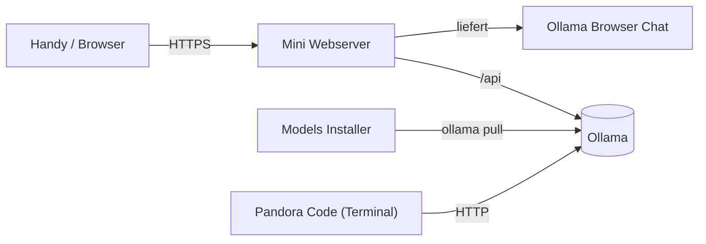
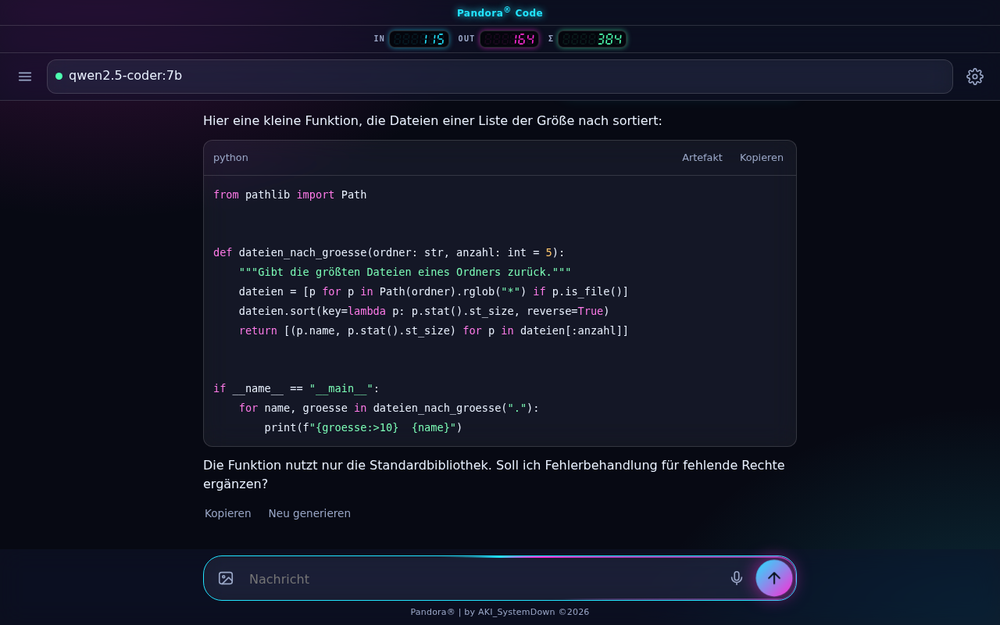
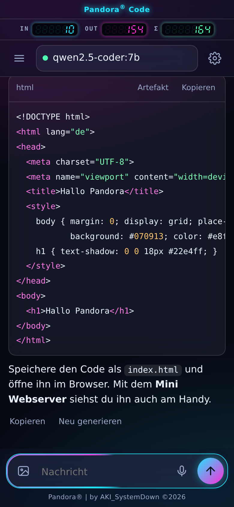
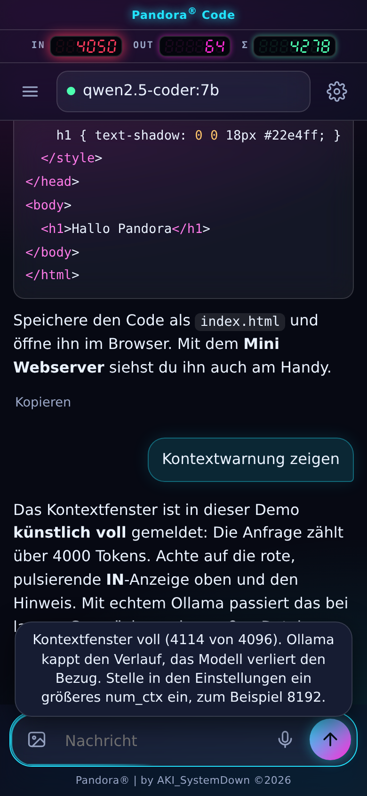
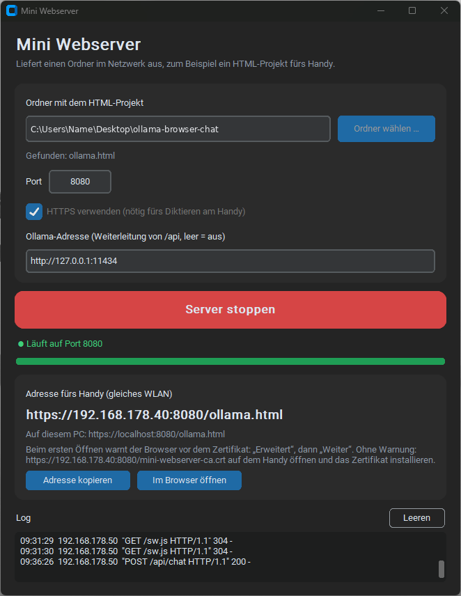
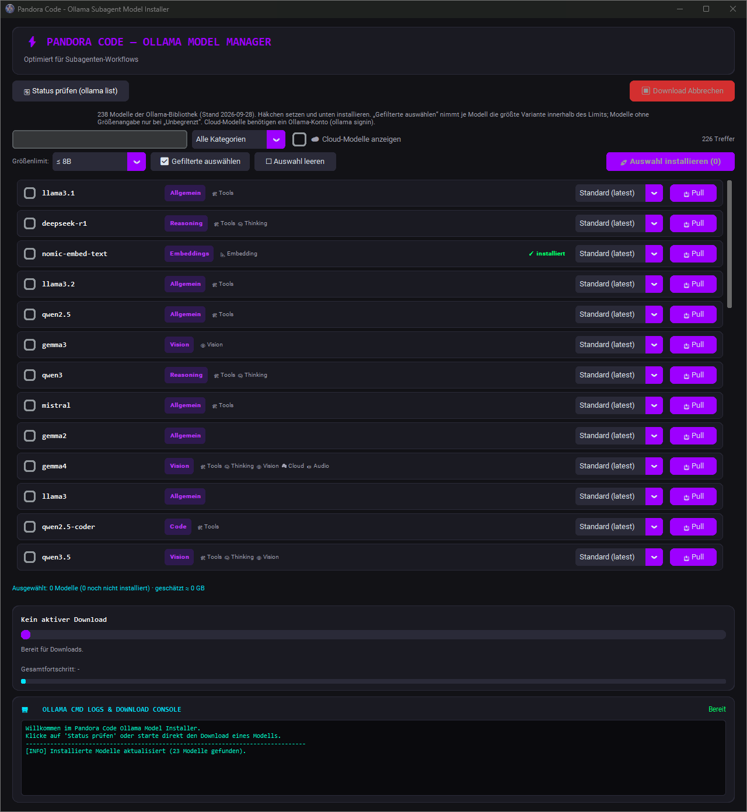
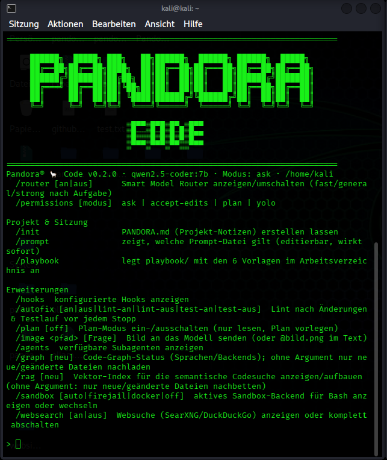
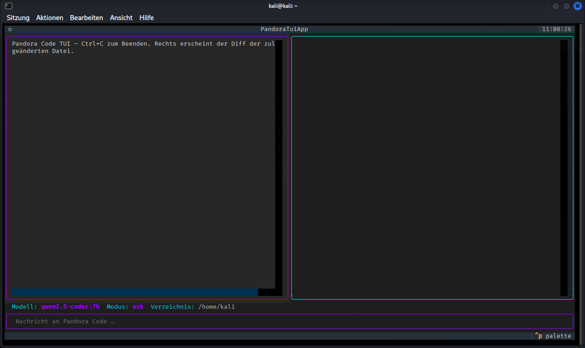

<div align="center">


# Pandora® AI System

**Dein lokales KI-Werkzeugset rund um Ollama: Modelle installieren, per Handy chatten, im Terminal programmieren. Ohne Cloud, ohne Konto, auf deiner eigenen Hardware.**

[](LICENSE)


[](https://github.com/bosancero85/PandoraAISystem/releases/latest)

[Landingpage mit Live-Simulator](https://bosancero85.github.io/PandoraAISystem/) · [Downloads](https://github.com/bosancero85/PandoraAISystem/releases/latest) · [English](README.md)

</div>

---

## Inhalt

- [Überblick](#überblick)
- [Die vier Werkzeuge](#die-vier-werkzeuge)
- [Schnellstart](#schnellstart)
- [Downloads](#downloads)
- [Aus dem Quellcode bauen](#aus-dem-quellcode-bauen)
- [Projektstruktur](#projektstruktur)
- [Tests](#tests)
- [Lizenz](#lizenz)

## Überblick

Pandora AI System bündelt vier kleine Programme, die zusammen eine komplette lokale KI-Umgebung ergeben. Alles läuft über [Ollama](https://ollama.com) auf deinem eigenen Rechner. Es werden keine Daten an Dritte geschickt.



Der **Mini Webserver** liefert den Chat per HTTPS ans Handy aus (nur dann gibt der Browser das Mikrofon zum Diktieren frei) und leitet `/api` an Ollama weiter. Der **Models Installer** holt die Modelle, **Pandora Code** nutzt sie als Coding-Agent im Terminal.

## Die vier Werkzeuge

### 1. Ollama Browser Chat

Chat-Oberfläche für Handy und Desktop in einer Handvoll Dateien, ohne Abhängigkeiten, ohne CDN. Chats, Projekte und Artefakte bleiben lokal im Browser.

- Streaming-Antworten mit Abbrechen, Markdown und Code-Blöcken mit Kopieren-Knopf
- **Digitale 7-Segment-Token-Anzeige** (IN, OUT, Σ) mit **Kontextwarnung**: Wird das Kontextfenster voll, färbt sich IN gelb und dann rot
- Diktieren per Spracheingabe, Bild- und Datei-Anhänge, mehrere Chats, Export und Import
- Als App auf dem Homescreen installierbar (PWA)

<p align="center">
  
  
  
</p>

Die Chat-Bilder entstanden mit der echten App und simulierten Antworten. Unter [Landingpage](https://bosancero85.github.io/PandoraAISystem/) kannst du denselben **Live-Simulator** direkt im Browser ausprobieren.

Ordner: [`apps/ollama-browser-chat`](apps/ollama-browser-chat)

### 2. Mini Webserver

Windows-Werkzeug (auch aus dem Quellcode unter Linux und macOS startbar), das einen Ordner im Netzwerk ausliefert. Ersetzt `python -m http.server`.

- Start/Stopp per Knopf, Log, Adresse fürs Handy mit Kopieren-Knopf, Tray-Symbol
- **HTTPS** mit selbst erzeugter Zertifizierungsstelle, die sich bei IP-Wechsel automatisch ein neues Zertifikat ausstellt
- **Ollama-Weiterleitung** (`/api`) mit Streaming, damit HTTPS-Seiten kein unsicheres `http://`-Ollama aufrufen müssen

<p align="center"></p>

Ordner: [`apps/mini-webserver`](apps/mini-webserver)

### 3. Ollama Models Library & Installer

Grafische Oberfläche statt `ollama pull …`: die komplette Ollama-Bibliothek (238 Modellfamilien), Suche, Kategorien, Größenwahl, Speicherschätzung und Batch-Installation mit Fortschritt.

<p align="center"></p>

Ordner: [`apps/ollama-models-installer`](apps/ollama-models-installer)

### 4. Pandora Code

Lokaler Coding-Agent für das Terminal, bedient wie Claude Code, aber über deinen Ollama-Server und nur mit der Python-Standardbibliothek.

- Werkzeuge: Read, Write, Edit, Bash, Glob, Grep, LS, TodoWrite. Änderungen und Befehle bestätigst du mit Diff-Vorschau
- Berechtigungsmodi `ask`, `accept-edits`, `plan` (nur lesen) und `yolo`
- Modell-Router mit automatischem Fallback, AST-Code-Graph, Vektor-RAG, Auto-Fix (Lint und Tests), Subagenten, Hooks, MCP, Bildeingabe
- Optionale Sandbox (Firejail oder Docker) und optionale Textual-Oberfläche (`--tui`)

<p align="center">
  
  
</p>

Ordner: [`apps/pandora-code`](apps/pandora-code)

## Schnellstart

1. **Ollama installieren:** <https://ollama.com/download>
2. **Modelle holen** mit dem **Models Installer** (oder `ollama pull qwen2.5-coder:7b`).
3. **Mini Webserver** starten, den Ordner `apps/ollama-browser-chat` wählen, HTTPS an lassen, auf „Server starten“ klicken. Läuft Ollama auf einem anderen Rechner, trage dessen Adresse ein.
4. Am **Handy** (gleiches WLAN) die angezeigte Adresse öffnen, zum Beispiel `https://192.168.178.40:8080/ollama.html`. Beim ersten Mal die Zertifikatswarnung bestätigen („Erweitert“, dann „Weiter“).
5. **Pandora Code** im Projektordner starten: `pandora code`.

> **Tipp für 8 GB Grafikspeicher:** `qwen2.5-coder:7b` läuft komplett auf der Grafikkarte. Stelle im Chat das Kontextfenster (`num_ctx`) auf 8192, damit lange Code-Antworten den Verlauf nicht sprengen.

## Downloads

Fertige Programme gibt es unter [Releases](https://github.com/bosancero85/PandoraAISystem/releases/latest). Die Mac-Programme sind für Apple Silicon (arm64) gebaut.

| Werkzeug | Windows | macOS | Linux |
|---|---|---|---|
| Models Installer | [`Ollama-Installer-Win.exe`](https://github.com/bosancero85/PandoraAISystem/releases/latest/download/Ollama-Installer-Win.exe) | [`Ollama-Installer-Mac.dmg`](https://github.com/bosancero85/PandoraAISystem/releases/latest/download/Ollama-Installer-Mac.dmg) | [`Ollama-Installer-Linux.AppImage`](https://github.com/bosancero85/PandoraAISystem/releases/latest/download/Ollama-Installer-Linux.AppImage) |
| Mini Webserver | [`MiniWebserver-Win.exe`](https://github.com/bosancero85/PandoraAISystem/releases/latest/download/MiniWebserver-Win.exe) | [`MiniWebserver-Mac.dmg`](https://github.com/bosancero85/PandoraAISystem/releases/latest/download/MiniWebserver-Mac.dmg) | [`MiniWebserver-Linux.AppImage`](https://github.com/bosancero85/PandoraAISystem/releases/latest/download/MiniWebserver-Linux.AppImage) |
| Pandora Code | [`pandora-code-Win.exe`](https://github.com/bosancero85/PandoraAISystem/releases/latest/download/pandora-code-Win.exe) | [`pandora-code-Mac.tar.gz`](https://github.com/bosancero85/PandoraAISystem/releases/latest/download/pandora-code-Mac.tar.gz) | [`pandora-code-Linux`](https://github.com/bosancero85/PandoraAISystem/releases/latest/download/pandora-code-Linux) oder [`.deb`](https://github.com/bosancero85/PandoraAISystem/releases/latest/download/pandora-code-Linux.deb) |
| Ollama Browser Chat | [`Ollama-Browser-Chat-Web.zip`](https://github.com/bosancero85/PandoraAISystem/releases/latest/download/Ollama-Browser-Chat-Web.zip) (für alle Systeme, Ordner entpacken und ausliefern) | | |

Die Prüfsummen stehen in `SHA256SUMS.txt` im selben Release.

**Hinweise:**

- **Linux:** AppImage mit `chmod +x <Datei>` ausführbar machen. Das `.deb` installierst du mit `sudo apt install ./pandora-code-Linux.deb`.
- **macOS:** Die Programme sind nicht signiert. Beim ersten Start: Rechtsklick auf die App, „Öffnen“.
- **Windows:** SmartScreen warnt bei unsignierten Programmen. „Weitere Informationen“, dann „Trotzdem ausführen“.

## Aus dem Quellcode bauen

Ein einziges Skript baut alles für das System, auf dem du gerade arbeitest (PyInstaller kann nicht für andere Systeme bauen):

```bash
pip install -r requirements-build.txt
python scripts/build_release.py --app all          # oder: installer | webserver | code | chat
```

Das Ergebnis liegt in `release/`. Mit `--dry-run` zeigt das Skript nur die Befehle an. Zusätzlich hat jedes Werkzeug seine eigenen Build-Dateien (`build.bat`, `build_mac.sh`, `build_deb.sh`) in seinem Ordner.

Der Release-Workflow [`.github/workflows/release.yml`](.github/workflows/release.yml) baut alle Pakete für Windows, macOS und Linux und hängt sie an ein Release, sobald du einen Tag wie `v1.0.0` pusht:

```bash
git tag v1.0.0
git push origin v1.0.0
```

## Projektstruktur

```text
PandoraAISystem/
├── index.html                  Landingpage (eine Datei, mit Live-Simulator)
├── apps/
│   ├── ollama-browser-chat/    Chat (HTML, CSS, JS) und PWA-Dateien
│   ├── mini-webserver/         HTTPS-Webserver mit Ollama-Weiterleitung (Python)
│   ├── ollama-models-installer/  Modell-Installer (Python, CustomTkinter)
│   └── pandora-code/           Coding-Agent fürs Terminal (Python)
├── scripts/                    Landingpage-Bau, Release-Pakete, Tests
├── docs/                       Banner, Logo, Screenshots
├── .github/workflows/          ci.yml, release.yml, pages.yml
└── playbook/                   Projektsteuerung
```

Die Landingpage wird aus `scripts/landing_template.html`, den Screenshots und dem echten Chat zu einer einzigen `index.html` gebaut: `python scripts/build_landing.py`.

## Tests

```bash
node apps/ollama-browser-chat/tests/run.js                      # Chat
python -m unittest discover -s apps/mini-webserver/tests        # Webserver
python -m unittest discover -s apps/pandora-code/tests -t apps/pandora-code   # Pandora Code
python -m unittest discover -s scripts -p "test_*.py"           # Landingpage und Build-Skript
```

Die GitHub-Aktion [`ci.yml`](.github/workflows/ci.yml) führt alle Tests bei jedem Push aus.

## Lizenz

MIT, siehe [LICENSE](LICENSE). Pandora® | by AKI_SystemDown ©2026
