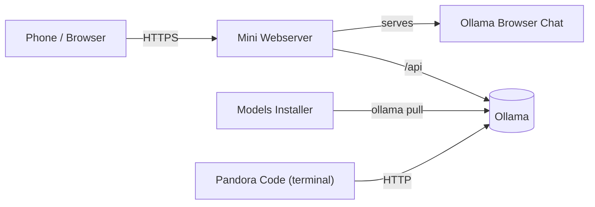

<div align="center">


# Pandora® AI System

**Your local AI toolkit around Ollama: install models, chat from your phone, code in the terminal. No cloud, no account, on your own hardware.**

[](LICENSE)


[](https://github.com/bosancero85/PandoraAISystem/releases/latest)

[Landing page with live simulator](https://bosancero85.github.io/PandoraAISystem/) · [Downloads](https://github.com/bosancero85/PandoraAISystem/releases/latest) · [Deutsch](README.de.md)

</div>

---

## Contents

- [Overview](#overview)
- [The four tools](#the-four-tools)
- [Quick start](#quick-start)
- [Downloads](#downloads)
- [Build from source](#build-from-source)
- [Repository layout](#repository-layout)
- [Tests](#tests)
- [License](#license)

> The user interfaces and the in-depth documentation of the tools are in German. A full German README is available in [README.de.md](README.de.md).

## Overview

Pandora AI System bundles four small programs that together form a complete local AI environment. Everything runs through [Ollama](https://ollama.com) on your own machine. No data is sent to third parties.



The **Mini Webserver** serves the chat to your phone over HTTPS (browsers only allow the microphone for dictation on secure origins) and forwards `/api` to Ollama. The **Models Installer** fetches models, **Pandora Code** uses them as a coding agent in the terminal.

## The four tools

### 1. Ollama Browser Chat

A chat UI for phone and desktop in a handful of files, with no dependencies and no CDN. Chats, projects and artifacts stay in your browser.

- Streaming answers with stop button, Markdown and code blocks with a copy button
- **Digital 7-segment token display** (IN, OUT, Σ) with a **context warning**: when the context window fills up, IN turns yellow, then red
- Voice dictation, image and file attachments, multiple chats, export and import
- Installable on the home screen (PWA)

<p align="center">
  
  
  
</p>

These chat images were taken with the real app and simulated answers. The [landing page](https://bosancero85.github.io/PandoraAISystem/) lets you try the same **live simulator** in your browser.

Folder: [`apps/ollama-browser-chat`](apps/ollama-browser-chat)

### 2. Mini Webserver

A Windows tool (also runnable from source on Linux and macOS) that serves a folder on your network. Replaces `python -m http.server`.

- Start/stop button, access log, phone address with copy button, tray icon
- **HTTPS** with a self-made certificate authority that re-issues its certificate when your IP changes
- **Ollama forwarding** (`/api`) with streaming, so HTTPS pages do not have to call an insecure `http://` Ollama

<p align="center"></p>

Folder: [`apps/mini-webserver`](apps/mini-webserver)

### 3. Ollama Models Library & Installer

A graphical interface instead of `ollama pull …`: the full Ollama library (238 model families), search, categories, size selection, storage estimate and batch installation with progress.

<p align="center"></p>

Folder: [`apps/ollama-models-installer`](apps/ollama-models-installer)

### 4. Pandora Code

A local coding agent for the terminal, operated like Claude Code but running on your Ollama server and using only the Python standard library.

- Tools: Read, Write, Edit, Bash, Glob, Grep, LS, TodoWrite. You confirm changes and commands with a diff preview
- Permission modes `ask`, `accept-edits`, `plan` (read only) and `yolo`
- Model router with automatic fallback, AST code graph, vector RAG, auto-fix (lint and tests), subagents, hooks, MCP, image input
- Optional sandbox (Firejail or Docker) and optional Textual interface (`--tui`)

<p align="center">
  
  
</p>

Folder: [`apps/pandora-code`](apps/pandora-code)

## Quick start

1. **Install Ollama:** <https://ollama.com/download>
2. **Get models** with the **Models Installer** (or `ollama pull qwen2.5-coder:7b`).
3. Start the **Mini Webserver**, pick the folder `apps/ollama-browser-chat`, keep HTTPS on, click "Server starten". If Ollama runs on another machine, enter its address.
4. On your **phone** (same Wi-Fi) open the shown address, for example `https://192.168.178.40:8080/ollama.html`. Confirm the certificate warning the first time ("Advanced", then "Proceed").
5. Run **Pandora Code** in a project folder: `pandora code`.

> **Tip for 8 GB of VRAM:** `qwen2.5-coder:7b` fits completely on the GPU. Set the context window (`num_ctx`) to 8192 in the chat so long code answers do not overflow the history.

## Downloads

Ready-made programs are on the [Releases](https://github.com/bosancero85/PandoraAISystem/releases/latest) page. The Mac builds target Apple Silicon (arm64).

| Tool | Windows | macOS | Linux |
|---|---|---|---|
| Models Installer | [`Ollama-Installer-Win.exe`](https://github.com/bosancero85/PandoraAISystem/releases/latest/download/Ollama-Installer-Win.exe) | [`Ollama-Installer-Mac.dmg`](https://github.com/bosancero85/PandoraAISystem/releases/latest/download/Ollama-Installer-Mac.dmg) | [`Ollama-Installer-Linux.AppImage`](https://github.com/bosancero85/PandoraAISystem/releases/latest/download/Ollama-Installer-Linux.AppImage) |
| Mini Webserver | [`MiniWebserver-Win.exe`](https://github.com/bosancero85/PandoraAISystem/releases/latest/download/MiniWebserver-Win.exe) | [`MiniWebserver-Mac.dmg`](https://github.com/bosancero85/PandoraAISystem/releases/latest/download/MiniWebserver-Mac.dmg) | [`MiniWebserver-Linux.AppImage`](https://github.com/bosancero85/PandoraAISystem/releases/latest/download/MiniWebserver-Linux.AppImage) |
| Pandora Code | [`pandora-code-Win.exe`](https://github.com/bosancero85/PandoraAISystem/releases/latest/download/pandora-code-Win.exe) | [`pandora-code-Mac.tar.gz`](https://github.com/bosancero85/PandoraAISystem/releases/latest/download/pandora-code-Mac.tar.gz) | [`pandora-code-Linux`](https://github.com/bosancero85/PandoraAISystem/releases/latest/download/pandora-code-Linux) or [`.deb`](https://github.com/bosancero85/PandoraAISystem/releases/latest/download/pandora-code-Linux.deb) |
| Ollama Browser Chat | [`Ollama-Browser-Chat-Web.zip`](https://github.com/bosancero85/PandoraAISystem/releases/latest/download/Ollama-Browser-Chat-Web.zip) (all systems, unzip and serve the folder) | | |

Checksums are in `SHA256SUMS.txt` in the same release.

**Notes:**

- **Linux:** make the AppImage executable with `chmod +x <file>`. Install the `.deb` with `sudo apt install ./pandora-code-Linux.deb`.
- **macOS:** the apps are not signed. On first launch: right-click the app, "Open".
- **Windows:** SmartScreen warns about unsigned programs. "More info", then "Run anyway".

## Build from source

One script builds everything for the system you are on (PyInstaller cannot cross-compile):

```bash
pip install -r requirements-build.txt
python scripts/build_release.py --app all          # or: installer | webserver | code | chat
```

The result is placed in `release/`. With `--dry-run` the script only prints the commands. Each tool also has its own build files (`build.bat`, `build_mac.sh`, `build_deb.sh`) in its folder.

The release workflow [`.github/workflows/release.yml`](.github/workflows/release.yml) builds all packages for Windows, macOS and Linux and attaches them to a release when you push a tag like `v1.0.0`:

```bash
git tag v1.0.0
git push origin v1.0.0
```

## Repository layout

```text
PandoraAISystem/
├── index.html                  Landing page (single file, with live simulator)
├── apps/
│   ├── ollama-browser-chat/    Chat (HTML, CSS, JS) and PWA files
│   ├── mini-webserver/         HTTPS web server with Ollama forwarding (Python)
│   ├── ollama-models-installer/  Model installer (Python, CustomTkinter)
│   └── pandora-code/           Terminal coding agent (Python)
├── scripts/                    Landing page build, release packaging, tests
├── docs/                       Banner, logo, screenshots
├── .github/workflows/          ci.yml, release.yml, pages.yml
└── playbook/                   Project control files
```

The landing page is built from `scripts/landing_template.html`, the screenshots and the real chat into one `index.html`: `python scripts/build_landing.py`.

## Tests

```bash
node apps/ollama-browser-chat/tests/run.js                      # chat
python -m unittest discover -s apps/mini-webserver/tests        # web server
python -m unittest discover -s apps/pandora-code/tests -t apps/pandora-code   # Pandora Code
python -m unittest discover -s scripts -p "test_*.py"           # landing page and build script
```

The GitHub Action [`ci.yml`](.github/workflows/ci.yml) runs all tests on every push.

## License

MIT, see [LICENSE](LICENSE). Pandora® | by AKI_SystemDown ©2026
